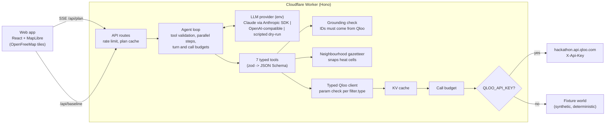

# Tasteplot

**Open where your customers' taste already lives.** A brand describes its target customer in plain words and names a few things those customers love. A Tasteplot agent uses Qloo's taste graph to map where that taste lives in a city. It ranks the neighbourhoods, then names the places and brands that audience already loves in each one: anchor tenants and co-marketing partners. Every pick shows its Qloo "why" score, and the result exports as a one-page site memo for a real-estate or expansion meeting.

Entry for the [Qloo Agentic Hackathon 2026](https://qloo.devpost.com/). MIT licensed.

> **Status (2026-10-06):** the app runs end to end on the **live Qloo hackathon API** when `QLOO_API_KEY` is set (badge `LIVE QLOO`), and on a synthetic **fixture world** without a key (badge `FIXTURE DATA`). Every endpoint and parameter was checked against the live API on 2026-10-06: [docs/QLOO_API_ASSUMPTIONS.md](docs/QLOO_API_ASSUMPTIONS.md).

## Try it

- **Live demo:** https://tasteplot.59jvbmwz5t.workers.dev (Cloudflare Workers, free, no login). Pick a sample brief and the plan builds in a few seconds.
- **The badge in the header** says which data the page uses: `LIVE QLOO` or `FIXTURE DATA`.
- **Sample briefs** (the brand names are fictional):
  - *Quietcup Coffee Roasters*, a specialty roaster: "specialty coffee, cycling, record stores", customers love Blue Bottle Coffee, Rapha and Kinfolk. Chicago, compared with New York. Second audience: Starbucks.
  - *Lowtide Supply Co.*, a streetwear label: a pop-up in Los Angeles for fans of Stüssy, Supreme and Tyler, the Creator. Second audience: Nike.
  - *Folio & Fern Books*, an indie bookshop chain: "literary fiction, bookstores, natural wine", London, for readers of Sally Rooney, The Paris Review and Haruki Murakami. Second audience: Waterstones.
  - *Ambiguous seed*: "Patagonia" is a brand and a region. The agent stops and asks.

## The problem

A small brand that opens a store or a pop-up bets a lease on one neighbourhood. Big chains buy foot-traffic and demographic data. A roaster with three cafes or a streetwear label with one pop-up budget picks on gut feel, a broker's pitch, or a chatbot answer. A chatbot names neighbourhoods by reputation, invents cafes, and puts real shops in the wrong part of town.

Tasteplot replaces the guess with taste data: where people who love what your customers love actually cluster, and which places and brands nearby they already love.

## What it does

1. **Resolve the audience.** Seeds go to `/search` (brands, artists, authors and other taste entities; single stores are left out). The agent turns the plain-words description into taste keywords and resolves them with `/v2/tags`; a tag counts only if its name has every word of the keyword. When a name is both a region and a taste entity ("Patagonia"), it stops and asks.
2. **Map the taste, then remove the popularity bias.** One `/v2/insights` call with `filter.type=urn:heatmap` and `filter.location.query=<metro>` for the audience, and one for a baseline audience (fans of restaurants: the metro's general going-out activity). Code snaps the geohash cells to named neighbourhoods and ranks them by **lift**: audience heat over baseline heat on the same cells. Raw heat alone puts busy downtowns first for every audience; lift shows where *this* audience over-indexes. Before and after: [docs/LIFT.md](docs/LIFT.md).
3. **Profile the audience** with `filter.type=urn:demographics` (aggregate age and gender skew only).
4. **Scout each hot neighbourhood in parallel.** `urn:entity:place` with `filter.location=POINT(lon lat)`, a radius in metres, the audience signals and `feature.explainability=true` gives anchor places.
5. **Find partner brands.** `urn:entity:brand` with the audience plus the neighbourhood's top anchor as the signal, and `signal.location` at the neighbourhood centre.
6. **Compare** (optional). A second metro gets its own heatmap call; a second audience goes to `/v2/analysis/compare`.
7. **Submit.** The server rejects the site plan if it cites any neighbourhood, place or brand ID that no Qloo call returned in this run. Code computes each site's score (0.6 x taste fit + 0.4 x mean affinity of the top 3 anchors; taste fit = lift / 2, capped at 1) and the order.
8. **Explain.** Each site card shows raw taste heat, lift vs the baseline, anchor affinity and the explainability chip ("Driven by Blue Bottle Coffee 0.76"). The trace panel shows every Qloo request.
9. **Export** a one-page site memo (Markdown download or print to PDF).
10. **Without Qloo.** The same brief goes to an LLM with no tools. Tasteplot checks each neighbourhood against the Qloo heat and each named place against Qloo `/search`, and shows the misses.

## Architecture



| Layer | File | Note |
|---|---|---|
| Qloo client | `src/qloo/client.ts` | One method per workflow. Checks parameters per `filter.type` against the docs tables, because Qloo ignores invalid ones silently. |
| Adapters | `src/qloo/types.ts` | The only place that reads Qloo JSON. Each field is tagged LIVE or DOC. |
| Transports | `src/qloo/transport.ts`, `src/qloo/index.ts` | HTTP with retry and a 4 requests/s pace (the key allows 5/s), KV or memory cache, call budget below the cache. |
| Fixture world | `src/qloo/fixtures/` | Synthetic taste graph for 4 metros and 43 neighbourhoods. Same wire shapes as the live API. |
| Recorded responses | `fixtures/qloo/recorded/` | Small curated live responses for the sample briefs. `tests/recorded.test.ts` runs the adapters on them. |
| Gazetteer | `src/shared/metros.ts` | Chicago, New York, Los Angeles, London with neighbourhood centres and radii. |
| Agent | `src/agent/loop.ts`, `tools.ts`, `prompt.ts` | Provider-agnostic loop. The LLM chooses keywords, neighbourhoods and picks. Code does snapping, scoring and grounding. |
| Memo | `src/agent/memo.ts` | Built by code from the grounded plan. |
| LLM providers | `src/llm/` | `anthropic.ts` (official SDK, `claude-opus-5-5`), `openai-compatible.ts`, `scripted.ts` (dry-run), `replay.ts` (record and replay). |
| Baseline | `src/agent/baseline.ts`, `scripts/eval-baseline.ts` | LLM-only answer, then each neighbourhood and place is checked in Qloo. |
| Server | `src/server/app.ts` | Same Hono app on Node (`src/dev-server.ts`) and Workers (`src/worker.ts`). |
| Web | `src/web/` | Map with geohash heat cells and anchor pins, live trace, site cards, compare, side-by-side, memo. |

### Qloo calls per plan

Measured live on 2026-10-06 for the coffee sample (3 sites, a compare metro and a second audience): 22 upstream calls, all visible in the trace panel. The other samples use 21. The baseline heatmap is cached for 7 days per metro, so it is usually free.

| Call | Count | Purpose |
|---|---|---|
| `/search` | 1 per seed | Entity IDs, disambiguation |
| `/v2/tags` | 1 per keyword | Tag IDs for the plain-words audience |
| `urn:heatmap` | 1 per metro | Taste heat, snapped to neighbourhoods |
| `urn:heatmap` (baseline) | 1 for the main metro | Going-out heat (fans of restaurants), for lift |
| `urn:demographics` | 1 | Audience skew for the marketing angle |
| `urn:entity:place` | 1 per scouted neighbourhood | Anchor places, with explainability |
| `urn:entity:brand` | 1 per scouted neighbourhood | Partner brands |
| `/v2/analysis/compare` | 0 or 1 | Second audience: shared tags and each side's own tags |

## Run it locally

Needs Node 20+ (22 recommended). No keys needed.

```bash
npm install
npm run dev        # API on :8787, web app on http://localhost:5173
npm test           # Qloo client, adapters, fixture world, agent loop, baseline, providers, server
npm run typecheck
npm run build
npm run eval       # LLM-only vs Qloo check on the illustrative fixtures (dry-run, $0)
```

Default mode is a full dry-run. The Qloo fixture world answers every call, and the **scripted** planner drives the tools in a fixed order. The output is deterministic: the same brief gives the same plan. Nothing leaves the machine except map tiles.

### Switch to the live Qloo API

```bash
cp .env.example .env
# set QLOO_API_KEY=...   (this one line switches all Qloo calls to hackathon.api.qloo.com)
npm run spike      # coverage table for the sample briefs + one raw response per endpoint (no LLM calls)
npx tsx --env-file=.env scripts/live-demo.ts   # every sample brief through /api/plan, live, with an independent grounding check ($0 LLM)
npm run dev
```

### Switch on the LLM planner (paid)

```bash
# in .env
LLM_PROVIDER=anthropic
ANTHROPIC_API_KEY=...
# optional: LLM_MODEL (default claude-opus-5-5), LLM_EFFORT (default medium), LLM_MAX_TURNS (default 24)
```

A key alone never switches on spend: `LLM_PROVIDER` must also be set. `LLM_RECORD=1` saves each live transcript under `fixtures/llm/agent/` for a $0 replay. `LLM_PROVIDER=openai-compatible` with `LLM_BASE_URL`, `LLM_API_KEY` and `LLM_MODEL` uses any `/chat/completions` server instead.

### Deploy

`scripts/publish.sh` does every step and is safe to run again. `deploy` and `repo` refuse to run without `--yes`.

```bash
scripts/publish.sh check          # tests, typecheck, build, secret scan (local only)
scripts/publish.sh key            # paste the Qloo key (hidden), write .env, run the live spike
scripts/publish.sh deploy --yes   # KV namespace, QLOO_API_KEY secret, wrangler deploy
scripts/publish.sh repo --yes     # public GitHub repo + push
```

One Worker serves `/api/*` and the built app from `dist/`. `MAX_QLOO_CALLS=48` keeps a plan inside the Workers Free subrequest limit.

**Quota protection.** The hackathon key allows 5 requests a second and 10,000 a month. The public demo guards it with Workers KV only (Workers Free plan):

- **Sample briefs cost 0 calls.** Their live plans are recorded in `public/samples/` (`scripts/live-demo.ts --samples`) and served as static files. They never expire.
- **Identical Qloo requests are cached** in KV for 7 days. Finished plans are cached for 30 days.
- **Daily cap on fresh Qloo calls**: `DAILY_QLOO_CAP` (default 250; 250 x 31 = 7,750 < 10,000). When less than one plan's worth is left, a new brief gets a recorded sample plan and a short note instead. The server also reads Qloo's `x-month-ratelimit-remaining` header and stops new plans below 300.
- **Per-IP limit**: `PLANS_PER_HOUR` new plans per address (default 10). Cached and sample plans do not count.
- The trace panel shows the fresh calls left today and Qloo's monthly count. `/api/health` returns the same numbers.

KV has no atomic counter, so two plans that start in the same second can both pass the check; the cap leaves room for that, and each plan's call budget is clipped to what is left.

## Why it needs Qloo

Without Qloo, Tasteplot has no input. Each number on a site card is a Qloo result: neighbourhood heat (heatmap), anchor affinity and explainability (places), partner affinity (brands), audience skew (demographics), and the audience comparison (analysis compare). The "Without Qloo" tab shows what the same brief gives with no tools.

## Limits and honest notes

- **Fixture data is synthetic.** Seed names (Blue Bottle Coffee, Rapha, Stüssy, Sally Rooney, ...) are real so a user can type them; their taste vectors are invented. Nine well-known real places sit at approximate real coordinates so the "Without Qloo" check has something real to find; their scores are invented. Every other place and every partner brand is fictional, and partner brands carry "(fixture)" in the name.
- **The sample brands are fictional.** Quietcup Coffee Roasters, Lowtide Supply Co., Folio & Fern Books and Switchback Outfitters are demo names.
- **The fixture LLM-only baseline is illustrative.** It was written by hand to show typical failure modes. It is not a measurement. `npm run eval -- --live --confirm-spend` produces the real number on 12 briefs.
- **The dry-run planner is scripted.** It follows the same tool order a model would. The trace and the provenance label say `scripted (dry-run)`.
- **Raw heat follows activity.** On the live API, heatmap affinity correlates 0.92 to 0.97 with popularity, so busy central areas (River North in Chicago, Downtown LA) get the highest raw heat for every audience. Tasteplot ranks by lift against a going-out baseline instead ([docs/LIFT.md](docs/LIFT.md)). Lift is small in some metros (LA: 1.06x to 1.15x), so each card also shows the raw heat.
- **Rate limit.** The hackathon key allows 5 requests per second and 10,000 per month, about 450 fresh plans. The public demo allows about 10 fresh plans a day (see Quota protection). Sample, cached plans and cached Qloo responses are free.
- **API facts** (shapes, limits, what Qloo ignores) are in [docs/QLOO_API_ASSUMPTIONS.md](docs/QLOO_API_ASSUMPTIONS.md), verified on 2026-10-06.
- **Taste, not traffic.** Qloo gives taste affinity, not foot traffic, rent or vacancy. The agent is told not to claim numbers that no tool returned, and the memo says so.
- **Coverage.** The gazetteer has 4 metros. Heat cells far from a known neighbourhood centre are drawn on the map but not ranked.
- **Safe use.** Only aggregate affinities. No personal data goes to Qloo. Demographics are used for a marketing angle only, never to infer anything about a person.

## AI disclosure

AI coding tools (Claude Code) wrote most of this code under the author's direction: the architecture, the tests and the documents. The author chose the idea, reviewed the code and is responsible for it. At run time, the optional planner is an LLM (Claude); the default demo planner is a scripted policy and says so in the UI.

## License

[MIT](LICENSE)
